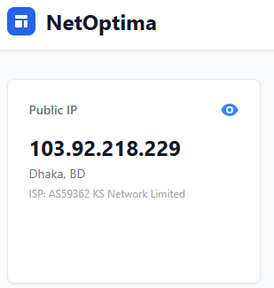
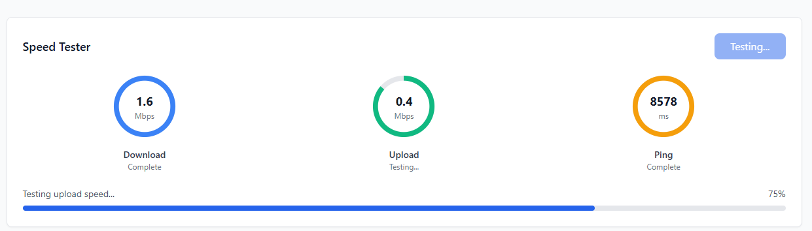
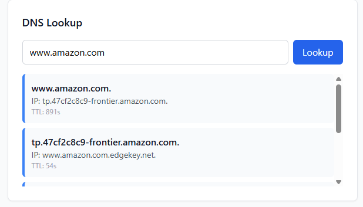
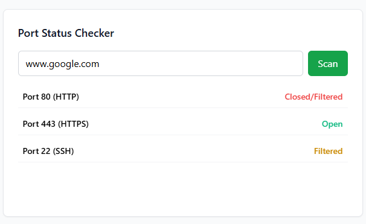
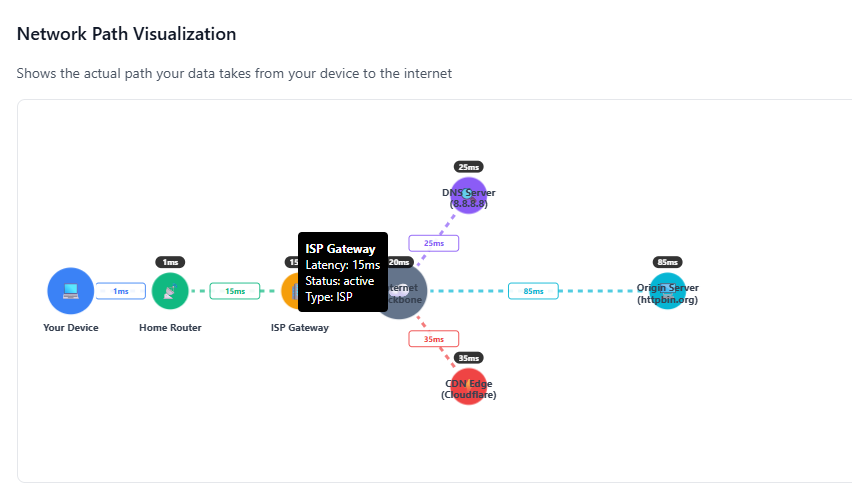
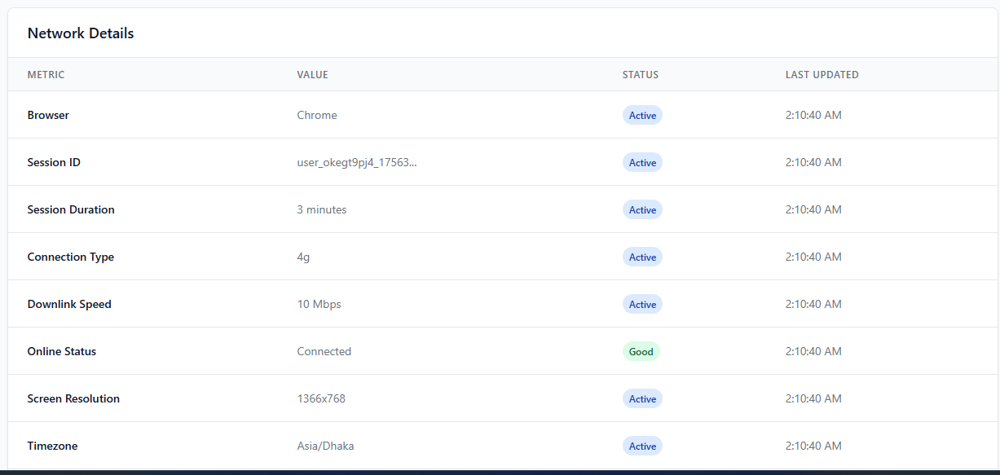

  <h1>🌐 NetOptima</h1>
  
<em>An All-in-One Network Diagnostic & Monitoring Dashboard</em>

---

  <h2>📌 Overview</h2>
  

    NetOptima is a browser-based network diagnostic dashboard that provides real-time monitoring and essential tools 
    for analyzing network performance. It allows users to test bandwidth speed, measure latency, perform DNS lookups, 
    scan open ports, and visualize network paths—all from a single lightweight web application.
  

  

    Designed with HTML, TailwindCSS, and JavaScript, NetOptima offers a seamless, responsive interface with interactive 
    charts and graphs powered by Chart.js and D3.js. Its goal is to make network troubleshooting simple, visual, and accessible 
    for students, developers, and IT professionals.
  

---

  <h2>✨ Key Features</h2>

<table>
  <tbody>
    <tr>
      <td align="center">
         
        <strong>Live Monitoring</strong>
      </td>
      <td align="center">
         
        <strong>Speed Tester</strong>
      </td>
      <td align="center">
         
        <strong>DNS Lookup</strong>
      </td>
    </tr>
    <tr>
      <td align="center">
        Monitor latency, bandwidth, and packet loss in real time to understand your network performance instantly.
      </td>
      <td align="center">
        Test download, upload speeds, and ping with intuitive gauges and visual progress indicators.
      </td>
      <td align="center">
        Resolve domain names to IP addresses quickly and accurately using integrated DNS lookup tools.
      </td>
    </tr>
    <tr>
      <td align="center">
         
        <strong>Port Scanner</strong>
      </td>
      <td align="center">
         
        <strong>Network Visualization</strong>
      </td>
      <td align="center">
         
        <strong>Analytics Dashboard</strong>
      </td>
    </tr>
    <tr>
      <td align="center">
        Check the status of common ports (80, 443, 22) for open/closed connectivity issues.
      </td>
      <td align="center">
        Interactive network path visualization showing the route from your device to external servers using D3.js.
      </td>
      <td align="center">
        Visualize bandwidth and latency trends over time with interactive charts powered by Chart.js.
      </td>
    </tr>
  </tbody>
</table>

---

  <h2>🛠️ Technologies Used</h2>
  <table>
    <thead>
      <tr>
        <th>Technology</th>
        <th>Purpose</th>
      </tr>
    </thead>
    <tbody>
      <tr><td><strong>HTML5</strong></td><td>Page structure and UI layout</td></tr>
      <tr><td><strong>TailwindCSS</strong></td><td>Modern, responsive styling</td></tr>
      <tr><td><strong>JavaScript</strong></td><td>Core functionality and interactivity</td></tr>
      <tr><td><strong>Chart.js</strong></td><td>Network performance charts & graphs</td></tr>
      <tr><td><strong>D3.js</strong></td><td>Interactive network path visualization</td></tr>
      <tr><td><strong>Browser APIs</strong></td><td>Fetching network-related data</td></tr>
    </tbody>
  </table>

---

  <h2>🚀 Getting Started</h2>
  <ol>
    <li>Clone the repository:
      <pre><code>git clone https://github.com/MossarrafHossainRobin/NetOptima.git</code></pre>
    </li>
    <li>Navigate to the project folder:
      <pre><code>cd NetOptima</code></pre>
    </li>
    <li>Open <code>index.html</code> in your browser</li>
    <li>Start running network diagnostics instantly — no installation required</li>
  </ol>

---

  <h2>📁 Project Structure</h2>
  <pre style="font-family: monospace;">
NetOptima/
├── <a href="index.html">index.html</a>                  
├── <a href="working_function.js">working_function.js</a> 
├── <a href="favicon.ico">favicon.ico</a>                
├── <a href="assets/">assets</a> 
├── <a href="NetOptima Project Report.zip">Project Report</a>   
└── <a href="README.md">README.md</a>                
  </pre>

---

  <h2>👨‍💻 Authors</h2>
  <table>
    <tr>
      <td align="center" valign="top">
        <strong>Mossarraf Hossain Robin</strong> 
        🎓 CSE Undergraduate Student 
        Green University of Bangladesh  
        
        
        
      </td>
      <td align="center" valign="top">
        <strong>Irfan Ferdous Siam</strong> 
        🎓 CSE Undergraduate Student 
        Green University of Bangladesh  
        
        
        
      </td>
    </tr>
  </table>

---

  <h2>📃 License</h2>
  

    
  

  
This project is licensed under the <strong>MIT License</strong> — free to use, modify, and distribute with proper attribution.

